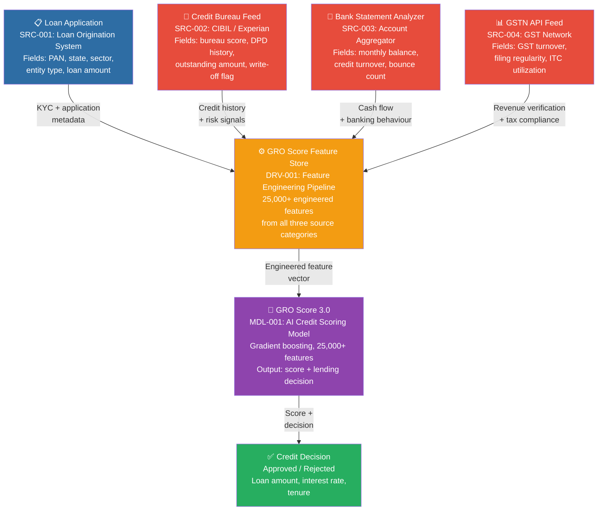

# GRO Score 3.0 — Data Lineage Map

This document traces the flow of data from raw source systems through
feature engineering to the final GRO Score credit decision.

All source systems and asset IDs reference the data asset inventory
in `catalogue/data_assets.json`.

## End-to-End Lineage

## Lineage by Data Field

| Field | Source System | Asset ID | Flows Into | Sensitivity |
|---|---|---|---|---|
| applicant_id | Loan Origination System | SRC-001 | Feature Store | Restricted |
| pan_number | Loan Origination System | SRC-001 | Feature Store, KYC checks | Restricted |
| state | Loan Origination System | SRC-001 | Feature Store | Internal |
| sector | Loan Origination System | SRC-001 | Feature Store | Internal |
| bureau_score | Credit Bureau Feed | SRC-002 | Feature Store | Restricted |
| dpd_30_count_12m | Credit Bureau Feed | SRC-002 | Feature Store | Restricted |
| dpd_90_count_12m | Credit Bureau Feed | SRC-002 | Feature Store | Restricted |
| write_off_flag | Credit Bureau Feed | SRC-002 | Feature Store | Restricted |
| avg_monthly_balance | Bank Statement Analyzer | SRC-003 | Feature Store | Restricted |
| avg_monthly_credit_turnover | Bank Statement Analyzer | SRC-003 | Feature Store | Restricted |
| bounce_count_6m | Bank Statement Analyzer | SRC-003 | Feature Store | Restricted |
| gst_filing_regularity_pct | GSTN API Feed | SRC-004 | Feature Store | Confidential |
| monthly_avg_gst_turnover | GSTN API Feed | SRC-004 | Feature Store | Confidential |
| gro_score | GRO Score Feature Store | DRV-001 | Credit Decision | Restricted |
| loan_status | GRO Score 3.0 Model | MDL-001 | LMS, Reporting | Internal |
| default_flag | GRO Score 3.0 Model | MDL-001 | NPA Monitoring | Restricted |

## Key Lineage Observations

**Single point of failure risk:** All three external data sources
(bureau, bank statement, GST) must successfully return data for a
complete feature vector. Failure of any one source results in an
incomplete feature set, requiring fallback logic or manual review.

**Sensitive data concentration:** The Feature Store (DRV-001) receives
Restricted data from all three source systems simultaneously, making
it the highest-risk asset in the pipeline from a data protection
perspective.

**Lineage opacity:** UGRO Capital publicly discloses the three source
categories but not the specific feature engineering logic applied in
DRV-001. This opacity makes independent model risk assessment
difficult and is a finding in Module 6's NIST AI RMF assessment.

## Disclaimer

This lineage map is reconstructed from publicly available information
about UGRO Capital's GRO Score 3.0. It is an approximation based on
disclosed data categories, not internal architecture documentation.
See project disclaimer at `docs/disclaimer.md`.
